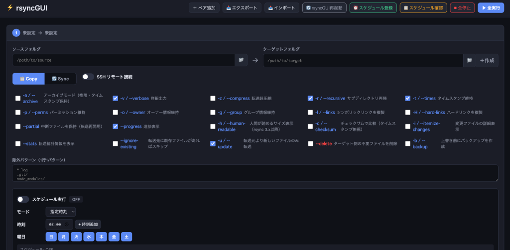

# rsyncGUI

rsync を Web ブラウザで設定・実行・スケジュール管理できるサービスです。

- リポジトリ: https://github.com/hirogura/rsyncgui
- 動作: 標準ポート **3326**（systemd サービス `rsyncgui` として常駐）
- インストール先: `/opt/rsyncgui`



## 必要なもの

- Linux（systemd が使える環境）
- パッケージマネージャ（apt / yum / dnf / apk）
- 以下はインストーラが自動的に導入します
  - `python3` / `rsync` / `sshpass` / `openssh-client` / `git`

## インストール方法

### 方法1: ワンライナー（推奨）

```bash
curl -fsSL https://raw.githubusercontent.com/hirogura/rsyncgui/main/install-rsyncgui.sh | sudo bash
```

### 方法2: 手動

```bash
# 一時ディレクトリにクローンして実行（/opt/rsyncgui が存在する場合は自動で移行します）
git clone https://github.com/hirogura/rsyncgui.git /tmp/rsyncgui-install
sudo /tmp/rsyncgui-install/install-rsyncgui.sh
rm -rf /tmp/rsyncgui-install
```

### インストーラが行うこと

1. 依存パッケージ（python3 / rsync / sshpass / ssh / git）の導入
2. `/opt/rsyncgui` へ GitHub リポジトリをクローン（既存の場合は最新版へ更新）
3. システムサービス `/etc/systemd/system/rsyncgui.service` の作成・起動

> 既存の `/opt/rsyncgui` に別の方法（旧インストーラ等）でインストール済みの場合、
> `config.json` / `intervals.json` / `logs/` はバックアップして復元されるため、
> 登録済みのペア設定やスケジュール、実行ログは失われません。

## 更新方法

```bash
sudo /opt/rsyncgui/install-rsyncgui.sh
```

または

```bash
sudo git -C /opt/rsyncgui pull
sudo systemctl restart rsyncgui
```

## アンインストール方法

```bash
# 1. サービスを停止・無効化
sudo systemctl stop rsyncgui
sudo systemctl disable rsyncgui

# 2. サービスの定義を削除
sudo rm -f /etc/systemd/system/rsyncgui.service
sudo systemctl daemon-reload

# 3. rsyncGUI が登録した cron（スケジュール）を削除
crontab -l 2>/dev/null | grep -v 'rsyncgui-managed' | crontab -

# 4. 一時的なパスワードファイルを削除（存在する場合）
sudo rm -f /tmp/rsyncgui_cron_pw_* /tmp/rsyncgui_pw_*

# 5. インストール先を削除
sudo rm -rf /opt/rsyncgui
```

> 注意: 手順5の削除により、登録した rsync ペア設定（`config.json`）や実行ログ（`logs/`）も
> すべて削除されます。必要な場合は事前にバックアップしてください。

## 利用方法

インストール後、ブラウザで `http://<サーバーのIP>:3326` を開きます。

- ペア追加: 送信元 / 送信先パスを指定して rsync を実行
- SSH 接続: ホスト・ユーザー・パスワード / 鍵を指定してリモート転送
- スケジュール: 曜日と時刻による cron 登録、または一定間隔の定期実行
- 全停止・再起動: 実行中のタスクを一括中断、GUI の再起動

## ディレクトリ構成

```
/opt/rsyncgui/
├── install-rsyncgui.sh   # インストーラ（GitHub から取得）
├── server.py             # バックエンド（HTTP サーバー）
├── cron_runner.sh        # スケジュール実行用ラッパー
├── public/index.html     # Web UI
├── .gitignore            # 個人情報・実行時データを push 対象から除外
├── config.json           # 登録ペア設定（作成時に自動生成 / Git 非管理）
├── intervals.json        # 定期実行設定（Git 非管理）
└── logs/                 # 実行ログ（Git 非管理）
```

## 個人情報について

`config.json`（SSH ホスト・ユーザー・パスワードや送信元/送信先パス）、`intervals.json`、
`logs/` などの実行時データは **リポジトリに push されません**（`.gitignore` で除外）。
バックアップ等で共有する際は十分注意してください。

## ライセンス

このプロジェクトは [MIT License](LICENSE) の下で公開されています。
